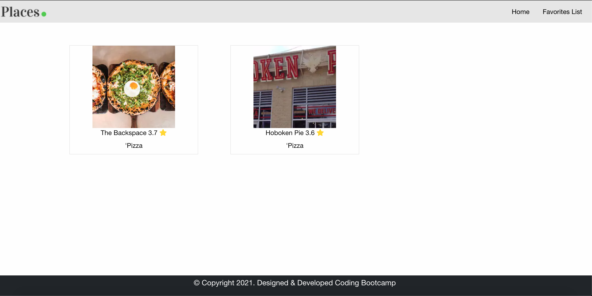

# FoodFeed

<h1>Description</h1>

FoodFeed is a web app for users that want to search for a place to eat whether it's local or in another city. Currently there are only a few default cities supported.

<h1>Links</h1>
<a href="https://joedonmalone.github.io/Project-1-Group-4/" target="_blank">Deployed Link<a>
 
<a href="https://github.com/JoeDonMalone/Project-1-Group-4" target="_blank">GitHub Repo<a>

<h1>Tech Stack</h1>
<ul>
    <li>HTML</li>
    <li>CSS</li>
    <li>JavaScript</li>
</ul>

<h1>APIs</h1>
<ul>
    <li><a href="https://openweathermap.org/api" target="_blank">OpenWeatherMap</a></li>
    <li><a href="https://developers.zomato.com/api" target="_blank">Zomato</a></li>
    <li><a href="https://developers.google.com/maps" target="_blank">Google Maps</a></li>
</ul>

<h1>User Interface</h1>
<h2>Home Page:</h2>

User is asked to share their location which will display the temperature of their current area. If a user denies access to their present location, the base location is considered as Austin, TX & the distance of the restaurant from it's actual address is calculated from Austin. User search is filtered by food type, city, and dining category.

<h2>Results:</h2>

Results are displayed below the search area. If a result box is clicked, a modal is displayed containing business details using Zomato's APIs. The "Website" button directs the user to the business's Zomato webpage, "Favorite this location" saves the business to the user's favorite list, and "Menu" directs the user to the business's menu on Zomato. A small map with the restaurant location pinned is displayed at the bottom and redirects users to Google Maps.

<h2>Favorites List:</h2>

Users can view their favorited locations by clicking on the "Favorites List" in the top right corner.

<h1>Testing:</h1>

Unit tested the page on Windows (Chrome, IE11 & Edge), Mac, Mobile to ensure that the layout is consistent in full view as well as in the responsive mode.

<h1>Challenges</h1>
<ul>
    <li>Finding free, working APIs</li>
    <li>Foundation CSS framework took time getting acquainted to</li>
    <li>Git issues and merge conflicts</li>
</ul>

<h1>Future Development</h1>
<ul>
    <li>Show restaurant menu, photos, and reviews on our web page</li>
    <li>Enable online ordering and order status</li>
    <li>Ability to share on social media</li>
</ul>
