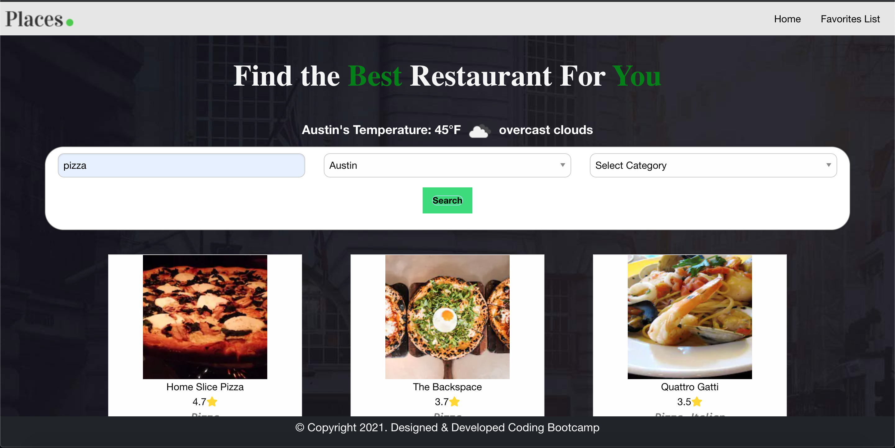
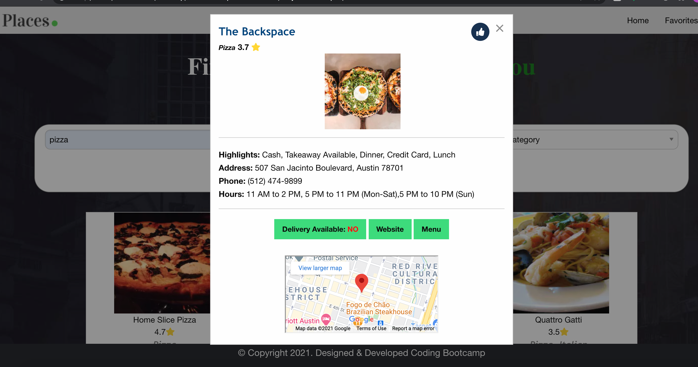

# Find My Restaurant

<strong> Project Summary: </strong>  
Application allowing user to find nearby or city specific restaurant and mark it as favorite.

        
        
        

 

<strong> Purpose: </strong>  
Apply learnings from Javascript with HTML, CSS & Bootstrap to build a multi-page Quiz application   

<strong> Description: </strong>  
 This application allows users to search for nearby or city specific restaurants based on cuisine type. Few default city searches are supported. If relevant results are available, those are displayed using Zomato APIs. Details like photo, restaurant name, cuisine type are displayed in
their individual result containers. These results are presently restricted to 9.

More details of the restaurant can be viewed by clicking on it & this opens a modal view with additional details such as:
Average User Ratings, Address, Hours, Contact Number, Price indicator, Mark as Favorite/Non-Favorite.
A Small location pin of the restaurant address is displayed using Google APIs.

If a user denies access to their present location, the base location is considered as Austin, TX & the distance of the restaurant from it's actual
address is calculated from Austin.

If a user allows access to their present location, distance of the restaurant is considered from that location.
 

<strong>API's used : </strong>  
Zomato API  
https://developers.zomato.com/documentation  

Open Weather map  
https://openweathermap.org/api
 
<strong>Testing: </strong>  
Unit tested the page on Windows (Chrome, IE11 & Edge), Mac, Mobile to ensure that the layout is consistent in full view as well as in the responsive mode.

<strong> Code Installation: </strong>  
$ cd [path_to_save_codebase]  
$ git clone https://github.com/JoeDonMalone/Project-1-Group-4  

<strong> Code-base: </strong>  
https://github.com/JoeDonMalone/Project-1-Group-4

<strong> Application Live URL: </strong>  
https://joedonmalone.github.io/Project-1-Group-4/

# pages 
https://joedonmalone.github.io/Project-1-Group-4/

# GitRepo
https://github.com/JoeDonMalone/Project-1-Group-4

